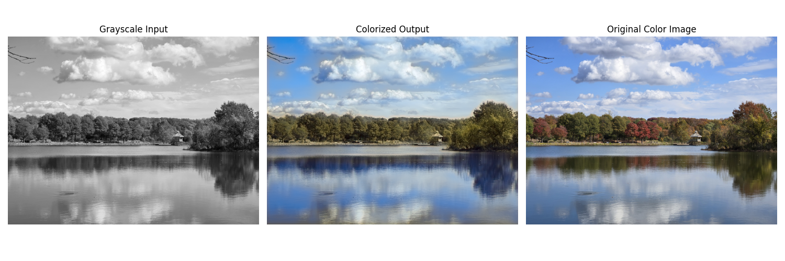
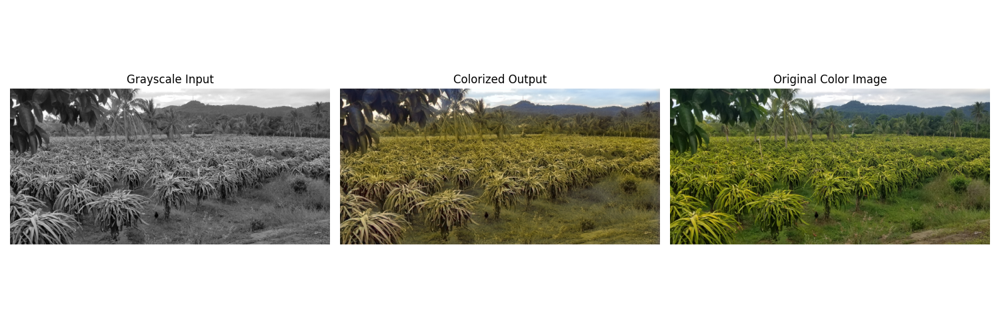
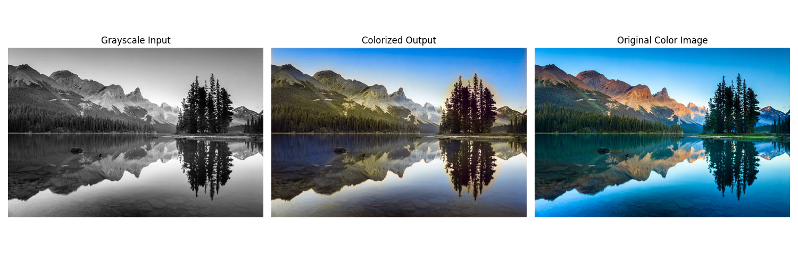
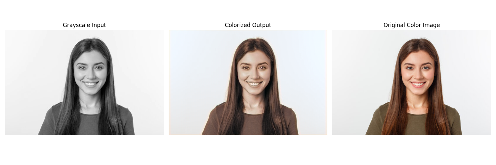
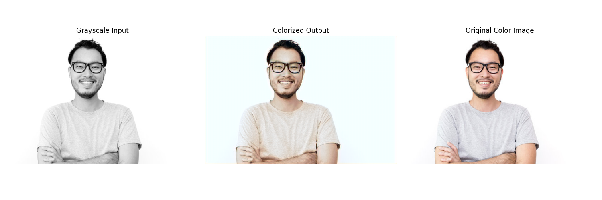
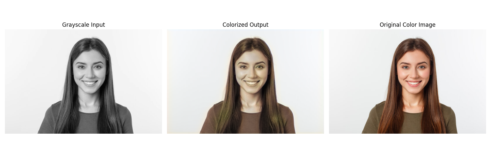
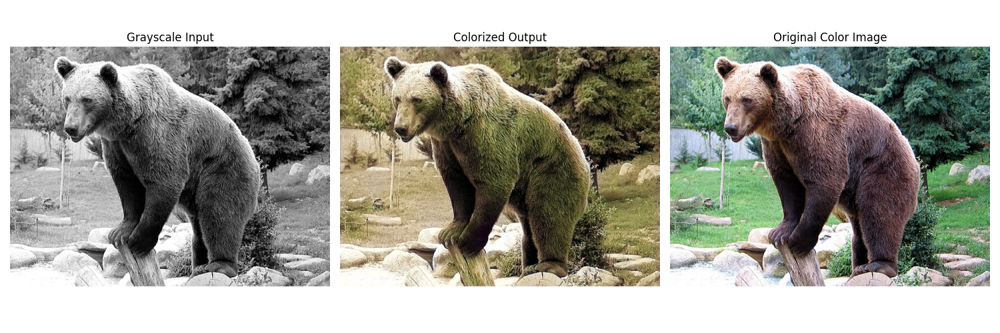

# Machine Learning Image Colorization Engine (CMSC 426 Final Project)

**Authors:** Rygel Yance, Daniel Pitzele, Minsi Hu  
**Affiliation:** University of Maryland, College Park  

---

## Abstract

This project addresses image colorization using a U-Net architecture to predict A/B chrominance channels from grayscale images (L channel) in the LAB color space. We trained models for specific image categories—landscapes, people, and a general dataset—to compare performance and accuracy. Specific models outperformed the general model, which tended to produce muted tones. Future improvements include using GANs and better loss functions to enhance realism.

---

## 1. Introduction

The colorization of grayscale images is an under-constrained machine learning task. Our goal was to explore how modern techniques like deep learning can produce plausible, vibrant color images from grayscale inputs using contextual cues.

### 1.1 Motivation

To understand and experiment with a practical implementation of image colorization using U-Net and evaluate how well it performs across image categories.

### 1.2 Related Work

Previous approaches used GANs, transformers, or pre-trained models. Our approach differs by using custom-trained U-Net architectures and category-specific training sets.

---

## 2. Method & Implementation

The system converts RGB images to LAB space, uses the L channel as input, and trains the model to predict A/B channels. Our implementation used PyTorch and trained on 256x256 images for hardware feasibility.

### 2.1 U-Net Architecture

The model uses convolutional blocks, residual connections, and upsampling via transpose convolutions.

**Architecture Overview:**

> **Architecture Diagram:**  
> __

### 2.2 Post-Processing

Predicted A/B channels are upscaled, recombined with the L channel, and converted to RGB. A/B channels are scaled to boost saturation.

---

## 3. Training Datasets

- **Landscapes:** 4,300 images from Flickr (via Kaggle).
- **People:** 1,668 images from a Kaggle gender detection dataset.
- **General:** 5,000 images from COCO2017 validation set.

---

## 4. Results

### 4.1 Landscapes

**Results:**  
__
__
__
__
__

### 4.2 People

**Results:**  
__
__
__
__
__

### 4.3 General Images

**Results:**  
__
__
__
__

---

## 5. Discussion

- **Landscape:** Accurate but sometimes overly blue due to sky bias; edge halos observed.
- **People:** Good skin/hair tones, though white backgrounds sometimes tinted blue.
- **General:** Muted color results due to loss averaging; lacks model complexity.

---

## 6. Edge Cases

- **People Edge Case:** Complex backgrounds lead to overall skin-tone tinting due to lack of training diversity.
- **Landscape Edge Case:** Short grass in certain images was misinterpreted as stone.

---

## 7. Limitations & Future Work

- **Resolution:** Training limited to 256x256 due to VRAM.
- **Saturation:** Output muted due to MSE loss.
- **Improvements:**
  - Use of GANs
  - Higher-resolution training
  - Larger, more diverse datasets (e.g., ImageNet)
  - Custom loss functions

---

## 8. References

1. Kumar et al., 2021 – [Colorization Transformer](https://arxiv.org/abs/2102.04432)  
2. Ballester et al., 2022 – [Analysis of Losses](https://arxiv.org/abs/2204.02980)  
3. Isola et al., 2016 – [pix2pix GAN](https://arxiv.org/abs/1611.07004)  
4. Mayali, 2022 – [GAN Colorization (GitHub)](https://github.com/mberkay0/image-colorization)  
5. Iqbal, 2018 – [PlotNeuralNet Framework](https://github.com/HarisIqbal88/PlotNeuralNet)  

**Training Data Sources:**
- [COCO 2017 Validation Set](https://cocodataset.org/#home)
- [Kaggle Huma]()
